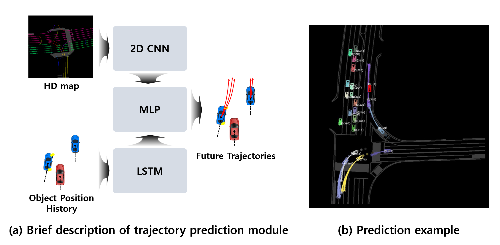
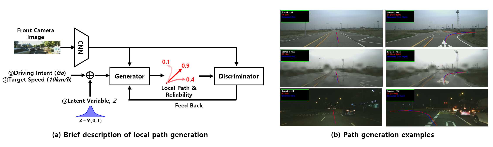
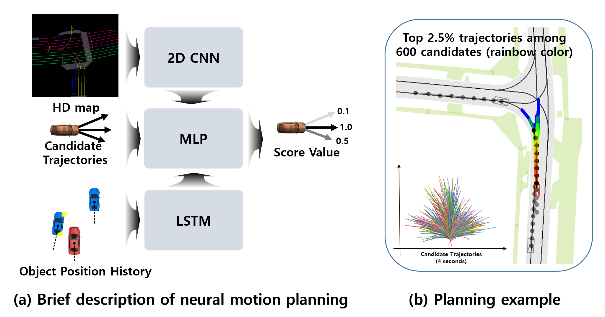

## Future Trajectory Forecasting

+ **D. Choi, K. Min, "Hierarchical Latent Structure for Multi-Modal Vehicle Trajectory Forecasting," ECCV22.** [Arxiv](https://arxiv.org/abs/2207.04624), [Code](https://github.com/d1024choi/HLSTrajForecast)

+ **D. Choi, K. Min, J. Choi, "Regularising Neural Networks for Future Trajectory Prediction via Inverse Reinforcement Learning Framework," IET Computer Vision, 2020.** [Arxiv](https://arxiv.org/abs/1907.04525), [Code](https://github.com/d1024choi/traj-pred-irl)

+ **D. Choi, T.-H. An, K. Ahn, J. Choi "Future Trajectory Prediction via RNN and Maximum Margin Inverse Reinforcement Learning," ICMLA 2018.** [Paper](https://www.researchgate.net/publication/330238721_Future_Trajectory_Prediction_via_RNN_and_Maximum_Margin_Inverse_Reinforcement_Learning), [Code](https://github.com/d1024choi/trajpred_mmirl)

## Local Path Generation for Motion Planning

+ **D. Choi, S.-J. Han, K. Min, J. Choi, "PathGAN: Local Path Planning with Attentive Generative Adversarial Networks," ETRI Journal, 2022.** [Paper](https://www.researchgate.net/publication/363604723_PathGAN_Local_path_planning_with_attentive_generative_adversarial_networks), [Code](https://github.com/d1024choi/pathgan_pytorch)

## Neural Motion Planning

[back](./)
